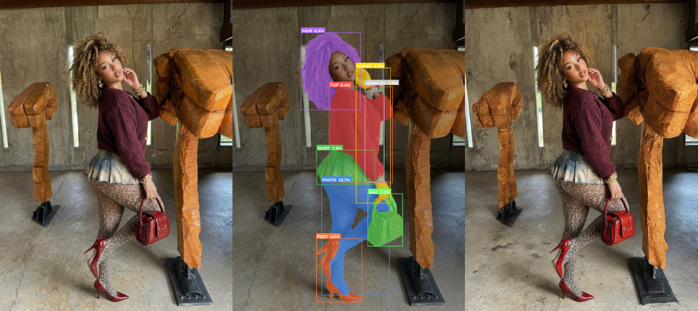
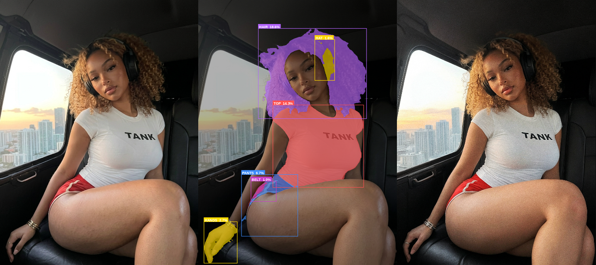
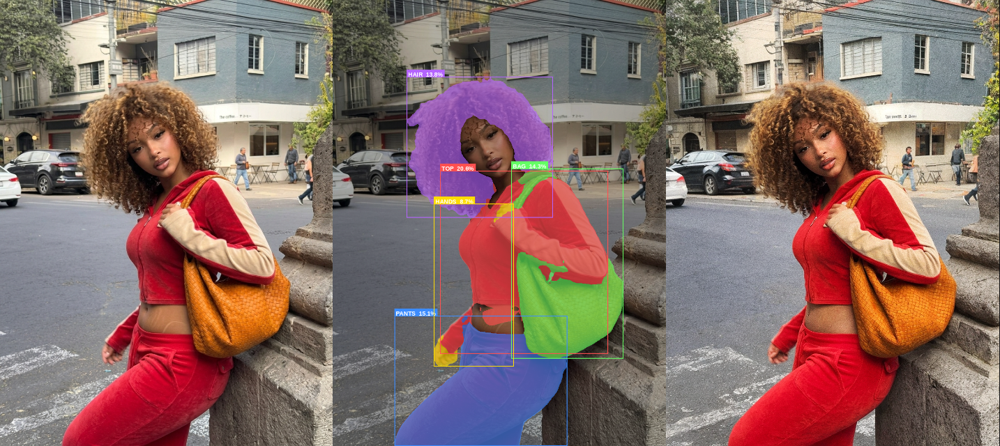
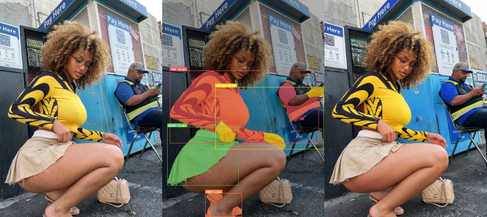

# AI Image Watermark Remover

**Easy tool to remove invisible AI watermarks from photos.**






### What it does
Removes hidden AI watermarks while protecting important parts like faces, hair, clothes, hands, text, and shoes etc.

### How to Use (Super Simple)
1. Run the program — it opens in your web browser.
2. Upload one or more photos.
3. Use the sliders to adjust cleaning strength (Balanced preset is a good start).
4. Click **Process batch**.
5. Download your cleaned images.

**Tip**: Set **Text strength to 0** for perfectly clear text.

### Google Colab (T4) 
```bash
# SETUP:
!pip install noai-watermark ultralytics gradio Pillow numpy fashn-human-parser
!pip install torch torchvision open-clip-torch einops timm
!pip install codeformer-inference easyocr gradio_client
```

```python
# ──────────────────────────────────────────────────────────────────────────────
#  IMPORTS
# ──────────────────────────────────────────────────────────────────────────────

import os, io, sys, types, shutil, zipfile, tempfile, warnings, urllib.request
from pathlib import Path

import numpy as np
from PIL import Image, ImageFilter, ImageDraw, ImageFont
from ultralytics import YOLO
import gradio as gr

from watermark_remover import WatermarkRemover

warnings.filterwarnings("ignore")

# ──────────────────────────────────────────────────────────────────────────────
#  TORCHVISION PATCH
# ──────────────────────────────────────────────────────────────────────────────

try:
    import torchvision.transforms.functional as _tvf
    _ft_stub = types.ModuleType("torchvision.transforms.functional_tensor")
    for _attr in ("rgb_to_grayscale","normalize","to_tensor","adjust_brightness",
                  "adjust_contrast","adjust_saturation","adjust_hue","center_crop",
                  "five_crop","ten_crop","resize","pad","hflip","vflip","rotate",
                  "perspective","gaussian_blur"):
        if hasattr(_tvf, _attr): setattr(_ft_stub, _attr, getattr(_tvf, _attr))
    sys.modules.setdefault("torchvision.transforms.functional_tensor", _ft_stub)
    print("  torchvision patch applied")
except Exception as _e:
    print(f"  torchvision patch failed: {_e}")


# ──────────────────────────────────────────────────────────────────────────────
#  FONT + TEXT SIZE HELPERS
# ──────────────────────────────────────────────────────────────────────────────

def _load_font(size=16):
    candidates = [
        "/usr/share/fonts/truetype/dejavu/DejaVuSans-Bold.ttf",
        "/usr/share/fonts/truetype/liberation/LiberationSans-Bold.ttf",
        "/usr/share/fonts/truetype/freefont/FreeSansBold.ttf",
        "/usr/share/fonts/truetype/ubuntu/Ubuntu-B.ttf",
        "/System/Library/Fonts/Helvetica.ttc",
        "/Library/Fonts/Arial Bold.ttf",
        "C:/Windows/Fonts/arialbd.ttf",
    ]
    for p in candidates:
        if Path(p).exists():
            try: return ImageFont.truetype(p, size=size)
            except: continue
    try:    return ImageFont.load_default(size=size)
    except: return ImageFont.load_default()

def _text_size(draw, text, font):
    try:
        bb = draw.textbbox((0,0), text, font=font)
        return bb[2]-bb[0], bb[3]-bb[1]
    except:
        try: return draw.textsize(text, font=font)
        except: return len(text)*8, 14


# ──────────────────────────────────────────────────────────────────────────────
#  FASHN HUMAN PARSER — clothing segmentation
# ──────────────────────────────────────────────────────────────────────────────

_clothing_parser = None

# Schema: 0=bg,1=face,2=hair,3=top,4=dress,5=skirt,6=pants,
#         7=belt,8=bag,9=hat,10=scarf,11=glasses,12=arms,13=hands,
#         14=legs,15=feet,16=torso,17=jewelry
CLOTHING_CLASS_IDS = {2, 3, 4, 5, 6, 7, 8, 9, 10, 11, 17} # hair, top, dress, skirt, pants, belt, bag, hat, scarf, glasses, jewelry
HAND_CLASS_IDS     = {13}              # hands
FEET_CLASS_IDS     = {15}             # feet (includes shoes in FASHN schema)

CLASS_LABELS = {
    0:"background",1:"face",2:"hair",3:"top",4:"dress",5:"skirt",
    6:"pants",7:"belt",8:"bag",9:"hat",10:"scarf",11:"glasses",
    12:"arms",13:"hands",14:"legs",15:"feet",16:"torso",17:"jewelry",
}

CLASS_COLORS = {
     2:(180, 100, 255, 160),  # hair -- purple-ish
     3:(255, 80, 80,160),     # top
     4:(255,140,  0,160),     # dress
     5:( 80,200, 80,160),     # skirt
     6:( 60,140,255,160),     # pants
     7:(200, 60,200,160),     # belt
     8:(100, 255, 100,160),   # bag -- lime
     9:(255, 215, 0,160),     # hat -- gold (optional)
    10:( 60,220,220,160),     # scarf
    11:(255, 100, 180,160),   # glasses -- pink
    13:(255,220,  0,160),     # hands
    15:(255,120, 60,160),     # feet
    -1:(200,200,200,160),     # text
    -2:(180,120,255,160),     # shoes
}


def get_clothing_parser():
    global _clothing_parser
    if _clothing_parser is None:
        print("  Loading FASHN Human Parser...")
        from fashn_human_parser import FashnHumanParser
        _clothing_parser = FashnHumanParser()
        print("  FASHN Human Parser ready")
    return _clothing_parser


def detect_human_regions(pil_img, min_area_ratio=0.005):
    """
    Returns (clothing_regions, hand_regions, feet_regions, seg_map).
    Each region: {"bbox":(x,y,w,h), "area_ratio":float, "class_id":int, "mask":PIL_L}
    """
    parser = get_clothing_parser()
    img_w, img_h = pil_img.size
    img_area = img_w * img_h
    seg_map  = parser.predict(pil_img)

    def _extract(class_ids):
        regions = []
        for cid in class_ids:
            binary = (seg_map == cid).astype(np.uint8) * 255
            if binary.max() == 0: continue
            ys, xs = np.where(binary > 0)
            x1,y1 = int(xs.min()), int(ys.min())
            x2,y2 = int(xs.max()), int(ys.max())
            rw,rh  = x2-x1, y2-y1
            ratio  = (rw*rh)/img_area
            if ratio < min_area_ratio: continue
            mask = Image.fromarray(binary,"L").crop((x1,y1,x2,y2))
            regions.append({"bbox":(x1,y1,rw,rh),"area_ratio":ratio,
                            "class_id":cid,"mask":mask})
        return regions

    return (_extract(CLOTHING_CLASS_IDS),
            _extract(HAND_CLASS_IDS),
            _extract(FEET_CLASS_IDS),
            seg_map)


# ──────────────────────────────────────────────────────────────────────────────
#  YOLO SEGMENTATION -- dedicated shoe detection (YOLO11n-seg)
# ──────────────────────────────────────────────────────────────────────────────
#
#  Note on COCO-80: COCO does not have a dedicated "shoe" class.
#  YOLO11n-seg is trained on COCO-80 by default. However, Ultralytics also
#  ships YOLO11-seg checkpoints trained on LVIS (1203 classes) which DO
#  include shoe/boot/sandal/sneaker. We try yolo11n-seg.pt (COCO) first and
#  check class names; if no shoe-adjacent class is found we log a warning and
#  fall back gracefully. For best results use:
#    _shoe_detector = YOLO("yolo11x-seg-lvis.pt")
#  or a purpose-trained footwear checkpoint.
#
_shoe_detector = None
SHOE_CLASS_NAMES = {
    "shoe","shoes","sneaker","sneakers","boot","boots","sandal","sandals",
    "high_heel","high heels","loafer","loafers","slipper","slippers",
    "cleat","cleats","footwear",
}


def get_shoe_detector():
    global _shoe_detector
    if _shoe_detector is None:
        print("  Loading YOLO11n-seg for shoe detection...")
        # auto-download from Ultralytics CDN on first run
        _shoe_detector = YOLO("yolo11n-seg.pt")
        # Log available class names once so user knows what to expect
        names = list(_shoe_detector.names.values())
        shoe_found = [n for n in names if any(s in n.lower() for s in SHOE_CLASS_NAMES)]
        if shoe_found:
            print(f"  Shoe-adjacent classes found: {shoe_found}")
        else:
            print("  WARNING: yolo11n-seg.pt (COCO-80) has no shoe class.")
            print("  For dedicated shoe detection use yolo11x-seg-lvis.pt or a")
            print("  footwear-specific checkpoint and update _shoe_detector path.")
        print("  YOLO11n-seg ready")
    return _shoe_detector


def detect_shoe_regions(pil_img, min_area_ratio=0.002, conf_threshold=0.25):
    """
    Run YOLO11n-seg and return regions for any shoe-adjacent class.
    Region dict: {"bbox":(x,y,w,h), "area_ratio":float,
                  "class_id":-2, "mask":PIL_L, "label":str}
    Falls back gracefully to [] if the model has no shoe class or detects nothing.
    """
    detector  = get_shoe_detector()
    img_np    = np.array(pil_img.convert("RGB"))
    img_w, img_h = pil_img.size
    img_area  = img_w * img_h

    results   = detector(img_np, verbose=False, conf=conf_threshold)[0]
    regions   = []

    if results.masks is None:
        return regions

    names = detector.names  # {int: str}

    for i, box in enumerate(results.boxes):
        cls_id   = int(box.cls[0])
        cls_name = names.get(cls_id, "").lower().replace(" ", "_")
        if not any(shoe in cls_name for shoe in SHOE_CLASS_NAMES):
            continue

        # Pixel mask from YOLO seg output
        mask_data = results.masks.data[i]          # torch tensor H x W (0/1)
        mask_np   = mask_data.cpu().numpy()
        mask_img  = Image.fromarray((mask_np * 255).astype(np.uint8), "L")
        mask_img  = mask_img.resize((img_w, img_h), Image.NEAREST)
        mask_arr  = np.array(mask_img)

        ys, xs = np.where(mask_arr > 0)
        if len(xs) == 0: continue
        x1,y1 = int(xs.min()), int(ys.min())
        x2,y2 = int(xs.max()), int(ys.max())
        rw, rh = x2 - x1, y2 - y1
        ratio  = (rw * rh) / img_area
        if ratio < min_area_ratio: continue

        cropped_mask = mask_img.crop((x1, y1, x2, y2))
        regions.append({
            "bbox":       (x1, y1, rw, rh),
            "area_ratio": ratio,
            "class_id":   -2,        # sentinel: YOLO shoe
            "mask":       cropped_mask,
            "label":      cls_name,
        })

    return regions


# ──────────────────────────────────────────────────────────────────────────────
#  TEXT DETECTION -- EasyOCR bounding boxes
# ──────────────────────────────────────────────────────────────────────────────

_ocr_reader = None

def get_ocr_reader():
    global _ocr_reader
    if _ocr_reader is None:
        print("  Loading EasyOCR...")
        import easyocr
        _ocr_reader = easyocr.Reader(["en"], gpu=False, verbose=False)
        print("  EasyOCR ready")
    return _ocr_reader


def detect_text_regions(pil_img, min_conf=0.4, padding_px=6):
    """Returns list of region dicts with bbox (x,y,w,h) for detected text."""
    reader = get_ocr_reader()
    img_np = np.array(pil_img.convert("RGB"))
    img_w, img_h = pil_img.size
    results = reader.readtext(img_np, detail=1)
    regions = []
    for (bbox_pts, text, conf) in results:
        if conf < min_conf or not text.strip(): continue
        xs = [p[0] for p in bbox_pts]; ys = [p[1] for p in bbox_pts]
        x1 = max(0, int(min(xs)) - padding_px)
        y1 = max(0, int(min(ys)) - padding_px)
        x2 = min(img_w, int(max(xs)) + padding_px)
        y2 = min(img_h, int(max(ys)) + padding_px)
        rw,rh = x2-x1, y2-y1
        if rw<4 or rh<4: continue
        regions.append({
            "bbox":(x1,y1,rw,rh),
            "area_ratio":(rw*rh)/(img_w*img_h),
            "class_id":-1,
            "text":text, "conf":conf,
        })
    return regions


# ──────────────────────────────────────────────────────────────────────────────
#  FACE DETECTION  (YOLOv8-face)
# ──────────────────────────────────────────────────────────────────────────────

_face_detector = None

def get_face_detector():
    global _face_detector
    if _face_detector is None:
        model_path = Path("yolov8n-face.pt")
        if not model_path.exists():
            urls = [
                "https://github.com/YapaLab/yolo-face/releases/download/1.0.0/yolov8n-face.pt",
                "https://github.com/lindevs/yolov8-face/releases/latest/download/yolov8n-face-lindevs.pt",
            ]
            for url in urls:
                try:
                    print(f"  Downloading yolov8n-face.pt...")
                    urllib.request.urlretrieve(url, model_path)
                    print("  Downloaded"); break
                except Exception as e:
                    print(f"  {e}")
            else:
                raise RuntimeError("Could not download yolov8n-face.pt")
        _face_detector = YOLO(str(model_path))
    return _face_detector


def detect_faces(pil_img):
    img_rgb  = np.array(pil_img.convert("RGB"))
    h, w     = img_rgb.shape[:2]
    detector = get_face_detector()
    results  = detector(img_rgb, verbose=False)[0]
    faces    = []
    for box in results.boxes:
        x1,y1,x2,y2 = map(int, box.xyxy[0].tolist())
        fw,fh = x2-x1, y2-y1
        faces.append({"bbox":(x1,y1,fw,fh),
                      "area_ratio":(fw*fh)/(w*h),
                      "score":float(box.conf[0])})
    return faces


# ──────────────────────────────────────────────────────────────────────────────
#  SEGMENTATION PREVIEW
# ──────────────────────────────────────────────────────────────────────────────

def render_segmentation_preview(pil_img, seg_map, all_region_groups):
    """all_region_groups: list of (regions_list) -- colour-coded overlay."""
    img_w, img_h = pil_img.size
    base = Image.alpha_composite(
        pil_img.convert("RGBA"),
        Image.new("RGBA",(img_w,img_h),(0,0,0,80)),
    )
    overlay = Image.new("RGBA",(img_w,img_h),(0,0,0,0))
    all_regions = [r for grp in all_region_groups for r in grp]
    for region in all_regions:
        cid   = region["class_id"]
        color = CLASS_COLORS.get(cid,(200,200,200,130))
        if cid >= 0:
            # FASHN parser class -- use seg_map
            if seg_map is None: continue
            binary    = (seg_map==cid).astype(np.uint8)*255
            mask_full = Image.fromarray(binary,"L").resize((img_w,img_h),Image.NEAREST)
        elif cid == -2:
            # YOLO shoe mask -- expand stored crop back to full canvas
            x,y,rw,rh = region["bbox"]
            mask_full  = Image.new("L",(img_w,img_h),0)
            if "mask" in region:
                resized = region["mask"].resize((rw,rh),Image.NEAREST)
                mask_full.paste(resized,(x,y))
        else:
            # text region -- solid rect
            x,y,rw,rh = region["bbox"]
            mask_full  = Image.new("L",(img_w,img_h),0)
            ImageDraw.Draw(mask_full).rectangle([x,y,x+rw,y+rh],fill=255)
        overlay.paste(Image.new("RGBA",(img_w,img_h),color), mask=mask_full)
    preview = Image.alpha_composite(base,overlay).convert("RGB")
    draw    = ImageDraw.Draw(preview)
    font    = _load_font(size=16)
    for region in all_regions:
        cid        = region["class_id"]
        x,y,rw,rh  = region["bbox"]
        rgb        = CLASS_COLORS.get(cid,(200,200,200,255))[:3]
        draw.rectangle([x,y,x+rw,y+rh],outline=rgb,width=2)
        if cid == -1:
            label = f"TEXT {region['conf']*100:.0f}%"
        elif cid == -2:
            label = f"SHOE({region.get('label','?')})  {region['area_ratio']*100:.1f}%"
        else:
            label = f"{CLASS_LABELS.get(cid,str(cid)).upper()}  {region['area_ratio']*100:.1f}%"
        tw,th = _text_size(draw,label,font); pad=4
        lx,ly = x, max(0,y-th-pad*2)
        draw.rectangle([lx,ly,lx+tw+pad*2,ly+th+pad*2],fill=(*rgb,220))
        draw.text((lx+pad,ly+pad),label,fill=(255,255,255),font=font)
    return preview


# ──────────────────────────────────────────────────────────────────────────────
#  TWO-PASS WATERMARK REMOVAL
# ──────────────────────────────────────────────────────────────────────────────

_remover_cache = {}

def get_remover(model_id, model_profile, device):
    key = (model_id, model_profile, device)
    if key not in _remover_cache:
        print(f"  Loading [{model_profile}] {model_id} on {device}...")
        kwargs = dict(model_id=model_id, device=device)
        try:    _remover_cache[key] = WatermarkRemover(**kwargs, model_profile=model_profile)
        except TypeError: _remover_cache[key] = WatermarkRemover(**kwargs)
    return _remover_cache[key]


def _run_removal(remover, pil_img, strength, steps, guidance_scale, seed):
    """Single removal pass -- PIL Image."""
    with tempfile.TemporaryDirectory() as tmpdir:
        in_p  = Path(tmpdir)/"input.png"
        out_p = Path(tmpdir)/"out.png"
        pil_img.save(in_p)
        remover.remove_watermark(
            image_path=in_p, output_path=out_p,
            strength=strength, num_inference_steps=steps,
            guidance_scale=guidance_scale,
            seed=seed if seed>=0 else None,
        )
        return Image.open(out_p).copy()


def _build_feather_mask(w, h, blend_radius_px):
    inner_w = max(1, w-2*blend_radius_px)
    inner_h = max(1, h-2*blend_radius_px)
    ox = (w-inner_w)//2; oy = (h-inner_h)//2
    m  = Image.new("L",(w,h),0)
    ImageDraw.Draw(m).rectangle([ox,oy,ox+inner_w-1,oy+inner_h-1],fill=255)
    return m.filter(ImageFilter.GaussianBlur(radius=max(1,blend_radius_px*0.35)))

def _build_pixel_feather_mask(pixel_mask_pil, blend_radius_px):
    return pixel_mask_pil.filter(
        ImageFilter.GaussianBlur(radius=max(1,blend_radius_px*0.35)))


def blend_region_from_gentle(full_result, gentle_result, region,
                              padding_px, blend_radius_px, use_pixel_mask=False,
                              target_strength=None):   # <-- NEW optional param
    """
    Special case for text (and zero-strength regions): direct paste with no feathering.
    """
    img_w, img_h = full_result.size
    x,y,rw,rh   = region["bbox"]
    x1 = max(0, x-padding_px);  y1 = max(0, y-padding_px)
    x2 = min(img_w,x+rw+padding_px); y2 = min(img_h,y+rh+padding_px)
    pw,ph = x2-x1, y2-y1
    if pw<=0 or ph<=0: return full_result

    # === NEW: Zero-strength direct paste (especially good for text) ===
    if target_strength is not None and target_strength <= 0.01:
        # Direct hard paste of original patch — no blending artifacts
        original_patch = gentle_result.crop((x1,y1,x2,y2))
        full_result.paste(original_patch, (x1,y1))
        return full_result

    # === Original feathered blend for non-zero strengths ===
    full_patch   = full_result.crop((x1,y1,x2,y2))
    gentle_patch = gentle_result.crop((x1,y1,x2,y2))

    if use_pixel_mask and "mask" in region:
        padded = Image.new("L",(pw,ph),0)
        padded.paste(region["mask"].resize((rw,rh),Image.NEAREST),(x-x1,y-y1))
        feather = _build_pixel_feather_mask(padded, blend_radius_px)
    else:
        feather = _build_feather_mask(pw, ph, blend_radius_px)

    blended = Image.composite(gentle_patch.convert("RGBA"),
                               full_patch.convert("RGBA"),
                               feather)
    full_result.paste(blended.convert("RGB"),(x1,y1))
    return full_result


# ──────────────────────────────────────────────────────────────────────────────
#  SUPIR  (detail restore)
# ──────────────────────────────────────────────────────────────────────────────

_supir_client = None

# FIX: was U+2212 (minus sign) -- replaced with ASCII hyphen-minus throughout
SUPIR_DEFAULTS = dict(
    s_stage1=-1, s_stage2=1000, s_cfg=7.5, num_samples=1,
    a_prompt=("cinematic photo, highly detailed, photorealistic, sharp focus, "
              "sharp fabric texture, fine skin pores, natural skin detail, "
              "studio lighting, 8k"),
    n_prompt=("blurry, smooth, plastic, over-processed, airbrushed, watermark, "
              "deformed, ugly, low quality"),
    color_fix_type="Wavelet",
    linear_CFG=True, linear_s_stage2=False, spt_linear_CFG=4.0,
)


def _supir_via_api(pil_img, edm_steps, log_fn):
    from gradio_client import Client, handle_file
    global _supir_client
    if _supir_client is None:
        log_fn("  Connecting to SUPIR Space...")
        _supir_client = Client("Kijai/SUPIR_wrapper", verbose=False)
    with tempfile.NamedTemporaryFile(suffix=".png",delete=False) as tmp:
        pil_img.save(tmp.name); path=tmp.name
    result = _supir_client.predict(
        handle_file(path), edm_steps,
        SUPIR_DEFAULTS["s_stage1"], SUPIR_DEFAULTS["s_stage2"],
        SUPIR_DEFAULTS["s_cfg"],    SUPIR_DEFAULTS["a_prompt"],
        SUPIR_DEFAULTS["n_prompt"], SUPIR_DEFAULTS["num_samples"],
        SUPIR_DEFAULTS["color_fix_type"], SUPIR_DEFAULTS["linear_CFG"],
        SUPIR_DEFAULTS["linear_s_stage2"], SUPIR_DEFAULTS["spt_linear_CFG"],
        api_name="/process",
    )
    Path(path).unlink(missing_ok=True)
    out = result[0] if isinstance(result,(list,tuple)) else result
    return Image.open(out).convert("RGB")


def _supir_fallback(pil_img, log_fn):
    log_fn("  SUPIR unavailable -- local sharpening fallback")
    w,h = pil_img.size
    up  = pil_img.resize((int(w*1.5),int(h*1.5)),Image.LANCZOS)
    up  = up.filter(ImageFilter.UnsharpMask(radius=1.2,percent=140,threshold=3))
    return up.resize((w,h),Image.LANCZOS)


def apply_supir(pil_img, edm_steps, log_fn=print):
    ow,oh = pil_img.size
    try:
        result = _supir_via_api(pil_img, edm_steps, log_fn)
        if result.size!=(ow,oh): result=result.resize((ow,oh),Image.LANCZOS)
        return result
    except Exception as e:
        log_fn(f"  SUPIR error ({e})")
        return _supir_fallback(pil_img, log_fn)


# ──────────────────────────────────────────────────────────────────────────────
#  CODEFORMER  (face detail pass)
# ──────────────────────────────────────────────────────────────────────────────

_codeformer_model = None

def get_codeformer():
    global _codeformer_model
    if _codeformer_model is None:
        print("  Loading CodeFormer...")
        try:
            from codeformer.basicsr.utils.download_util import load_file_from_url
            from codeformer.facelib.utils.face_restoration_helper import FaceRestoreHelper
            from codeformer.basicsr.archs.codeformer_arch import CodeFormer as CFNet
            import torch
            weights_dir = Path("codeformer_weights"); weights_dir.mkdir(exist_ok=True)
            ckpt_url  = ("https://github.com/sczhou/CodeFormer/releases/download/"
                         "v0.1.0/codeformer.pth")
            ckpt_path = weights_dir/"codeformer.pth"
            if not ckpt_path.exists():
                load_file_from_url(ckpt_url, model_dir=str(weights_dir))
            device = __import__("torch").device(
                "cuda" if __import__("torch").cuda.is_available() else "cpu")
            net = CFNet(dim_embd=512,codebook_size=1024,n_head=8,n_layers=9,
                        connect_list=["32","64","128","256"]).to(device)
            ckpt = __import__("torch").load(ckpt_path,map_location=device)["params_ema"]
            net.load_state_dict(ckpt); net.eval()
            helper = FaceRestoreHelper(upscale_factor=1,face_size=512,
                        crop_ratio=(1,1),det_model="retinaface_resnet50",
                        save_ext="png",use_parse=True,device=device)
            _codeformer_model = {"net":net,"helper":helper,"device":device}
            print("  CodeFormer ready")
        except Exception as e:
            print(f"  CodeFormer load failed: {e}")
    return _codeformer_model


def apply_codeformer(pil_img, fidelity, log_fn=print):
    import cv2, torch
    state = get_codeformer()
    if state is None:
        log_fn("  CodeFormer unavailable"); return pil_img
    net,helper,device = state["net"],state["helper"],state["device"]
    img_bgr = cv2.cvtColor(np.array(pil_img),cv2.COLOR_RGB2BGR)
    helper.clean_all()
    helper.read_image(img_bgr)
    helper.get_face_landmarks_5(only_center_face=False,resize=640,eye_dist_threshold=5)
    helper.align_warp_face()
    for crop in helper.cropped_faces:
        t = (torch.from_numpy(crop.transpose(2,0,1)).float()
             .div(255.).unsqueeze(0).to(device)*2-1)
        with torch.no_grad(): out = net(t,w=fidelity,adain=True)[0]
        out_np = (out.squeeze(0).permute(1,2,0).cpu().numpy().clip(-1,1)*0.5+0.5)*255
        helper.add_restored_face(out_np.astype(np.uint8), crop)
    helper.get_inverse_affine(None)
    restored = helper.paste_faces_to_input_image()
    return Image.fromarray(cv2.cvtColor(restored,cv2.COLOR_BGR2RGB))


# ──────────────────────────────────────────────────────────────────────────────
#  MAIN PROCESS FUNCTION
# ──────────────────────────────────────────────────────────────────────────────

def process_image(
    pil_img,
    # watermark removal -- global
    strength, steps, model_id, model_profile, device,
    guidance_scale, seed, strip_metadata,
    # per-region strengths
    clothing_strength, hand_strength, feet_strength,
    shoe_strength, text_strength,
    # face
    closeup_threshold, face_padding, blend_radius,
    # region toggles
    protect_clothing, protect_hands, protect_feet,
    protect_shoes, protect_text,
    # region options
    clothing_min_area, clothing_padding,
    hand_padding, feet_padding,
    shoe_padding, shoe_min_area, shoe_conf,
    text_padding, text_min_conf,
    # post-processing
    enable_enhance, supir_steps, codeformer_fidelity, enable_codeformer,
    log_fn=print,
):
    img_w, img_h = pil_img.size
    log_fn(f"  Image: {img_w}x{img_h}px")
    remover = get_remover(model_id, model_profile, device)

    # -- Pass 1: full-strength removal ----------------------------------------
    log_fn(f"  Pass 1: full strength ({strength})")
    full_result = _run_removal(remover, pil_img, strength, steps, guidance_scale, seed)

    # -- Detect faces ---------------------------------------------------------
    faces       = detect_faces(pil_img)
    small_faces = [f for f in faces if f["area_ratio"] < closeup_threshold]
    face_mode   = "protect" if small_faces else "full"
    log_fn(f"  Faces: {len(faces)} total, {len(small_faces)} protected")

    # -- Detect human parser regions ------------------------------------------
    clothing_regions, hand_regions, feet_regions, seg_map = [], [], [], None
    needs_parser = (protect_clothing or protect_hands or protect_feet)
    if needs_parser:
        log_fn("  Running FASHN Human Parser...")
        try:
            clothing_regions, hand_regions, feet_regions, seg_map = \
                detect_human_regions(pil_img, min_area_ratio=clothing_min_area)
            log_fn(f"  -> clothing:{len(clothing_regions)}  "
                   f"hands:{len(hand_regions)}  feet:{len(feet_regions)}")
        except Exception as e:
            log_fn(f"  Human parser error: {e}")

    # -- Detect shoes (YOLO11n-seg) -------------------------------------------
    shoe_regions = []
    if protect_shoes:
        log_fn("  Detecting shoes (YOLO11n-seg)...")
        try:
            shoe_regions = detect_shoe_regions(
                pil_img, min_area_ratio=shoe_min_area, conf_threshold=shoe_conf)
            log_fn(f"  -> {len(shoe_regions)} shoe region(s) found")
        except Exception as e:
            log_fn(f"  Shoe detection error: {e}")

    # -- Detect text ----------------------------------------------------------
    text_regions = []
    if protect_text:
        log_fn("  Detecting text regions (EasyOCR)...")
        try:
            text_regions = detect_text_regions(
                pil_img, min_conf=text_min_conf, padding_px=text_padding)
            log_fn(f"  -> {len(text_regions)} text region(s) found")
        except Exception as e:
            log_fn(f"  Text detection error: {e}")

    # -- Build region jobs: group by target strength --------------------------
    region_jobs = {}

    def _add_job(regions, target_strength, padding, use_pixel_mask=False):
        if not regions: return
        key = round(float(target_strength), 4)
        region_jobs.setdefault(key, [])
        for r in regions:
            region_jobs[key].append((r, padding, use_pixel_mask))

    if face_mode == "protect" and small_faces:
        _add_job(small_faces, 0.0, face_padding, False)

    if protect_clothing and clothing_regions:
        _add_job(clothing_regions, clothing_strength, clothing_padding, True)

    if protect_hands and hand_regions:
        _add_job(hand_regions, hand_strength, hand_padding, True)

    if protect_feet and feet_regions:
        _add_job(feet_regions, feet_strength, feet_padding, True)

    if protect_shoes and shoe_regions:
        _add_job(shoe_regions, shoe_strength, shoe_padding, True)

    if protect_text and text_regions:
        _add_job(text_regions, text_strength, text_padding, False)

    # -- Pass 2+: gentle passes per unique strength ---------------------------
    result = full_result.copy()
    gentle_cache = {}

    for target_strength, jobs in sorted(region_jobs.items()):
        if target_strength == 0.0:
            gentle_img = pil_img
        else:
            if target_strength not in gentle_cache:
                log_fn(f"  Pass 2 gentle (strength={target_strength})...")
                gentle_cache[target_strength] = _run_removal(
                    remover, pil_img, target_strength, steps, guidance_scale, seed)
            gentle_img = gentle_cache[target_strength]

        log_fn(f"  Blending {len(jobs)} region(s) at strength={target_strength}")
        for (region, padding, use_pixel_mask) in jobs:
            result = blend_region_from_gentle(
                result, gentle_img, region, padding, blend_radius, 
                use_pixel_mask, target_strength=target_strength) 
            
    # -- Segmentation preview -------------------------------------------------
    all_shown = []
    if protect_clothing: all_shown.append(clothing_regions)
    if protect_hands:    all_shown.append(hand_regions)
    if protect_feet:     all_shown.append(feet_regions)
    if protect_shoes:    all_shown.append(shoe_regions)
    if protect_text:     all_shown.append(text_regions)
    seg_preview = None
    if any(r for grp in all_shown for r in grp):
        seg_preview = render_segmentation_preview(pil_img, seg_map, all_shown)

    # -- Strip metadata -------------------------------------------------------
    if strip_metadata:
        buf = io.BytesIO(); result.save(buf,format="PNG")
        buf.seek(0); result = Image.open(buf).copy()

    # -- SUPIR + CodeFormer ---------------------------------------------------
    if enable_enhance:
        log_fn(f"  SUPIR ({supir_steps} steps)...")
        try:
            result = apply_supir(result, supir_steps, log_fn)
            log_fn(f"  SUPIR done -> {result.size[0]}x{result.size[1]}")
        except Exception as e:
            log_fn(f"  SUPIR skipped: {e}")
        if enable_codeformer and faces:
            log_fn(f"  CodeFormer (fidelity={codeformer_fidelity})...")
            try:
                result = apply_codeformer(result, codeformer_fidelity, log_fn)
                log_fn("  CodeFormer done")
            except Exception as e:
                log_fn(f"  CodeFormer skipped: {e}")

    return result, face_mode, seg_preview


# ──────────────────────────────────────────────────────────────────────────────
#  GRADIO  UI
# ──────────────────────────────────────────────────────────────────────────────

MODEL_PRESETS = {
    "DreamShaper 8 (default)":        "Lykon/dreamshaper-8",
    "Realistic Vision V5.1 (photos)": "SG161222/Realistic_Vision_V5.1_noVAE",
    "Realistic Vision V4.0":          "SG161222/Realistic_Vision_V4.0_noVAE",
    "SD v1.5 (baseline)":             "runwayml/stable-diffusion-v1-5",
}

_originals_store:   list = []
_seg_preview_store: list = []


def preview_uploads(files):
    return [f.name for f in files] if files else []


def run_batch(
    files, strength, steps, model_preset, model_profile, device,
    clothing_strength, hand_strength, feet_strength, shoe_strength, text_strength,
    closeup_threshold, face_padding, blend_radius,
    protect_clothing, protect_hands, protect_feet, protect_shoes, protect_text,
    clothing_min_area, clothing_padding, hand_padding, feet_padding,
    shoe_padding, shoe_min_area, shoe_conf,
    text_padding, text_min_conf,
    guidance_scale, seed, strip_metadata,
    enable_enhance, supir_steps, codeformer_fidelity, enable_codeformer,
    progress=gr.Progress(track_tqdm=True),
):
    global _originals_store, _seg_preview_store
    _originals_store = []; _seg_preview_store = []

    if not files:
        return [],"No files uploaded.",None,None,[],gr.update(visible=False)

    model_id    = MODEL_PRESETS.get(model_preset, model_preset)
    out_dir     = Path(tempfile.mkdtemp())/"cleaned"
    preview_dir = out_dir.parent/"seg_previews"
    out_dir.mkdir(parents=True,exist_ok=True)
    preview_dir.mkdir(parents=True,exist_ok=True)

    log_lines,result_images,seg_previews = [],[],[]
    def log(msg): print(msg); log_lines.append(msg)

    for i,file_obj in enumerate(progress.tqdm(files,desc="Processing")):
        fname = Path(file_obj.name).name
        log(f"[{i+1}/{len(files)}] {fname}")
        seg_path = None
        try:
            pil = Image.open(file_obj.name).convert("RGB")
            cleaned, mode, seg_preview = process_image(
                pil_img=pil,
                strength=strength, steps=steps,
                model_id=model_id, model_profile=model_profile, device=device,
                guidance_scale=guidance_scale, seed=seed,
                strip_metadata=strip_metadata,
                clothing_strength=clothing_strength,
                hand_strength=hand_strength,
                feet_strength=feet_strength,
                shoe_strength=shoe_strength,
                text_strength=text_strength,
                closeup_threshold=closeup_threshold,
                face_padding=face_padding, blend_radius=blend_radius,
                protect_clothing=protect_clothing,
                protect_hands=protect_hands,
                protect_feet=protect_feet,
                protect_shoes=protect_shoes,
                protect_text=protect_text,
                clothing_min_area=clothing_min_area,
                clothing_padding=clothing_padding,
                hand_padding=hand_padding,
                feet_padding=feet_padding,
                shoe_padding=shoe_padding,
                shoe_min_area=shoe_min_area,
                shoe_conf=shoe_conf,
                text_padding=text_padding,
                text_min_conf=text_min_conf,
                enable_enhance=enable_enhance, supir_steps=supir_steps,
                codeformer_fidelity=codeformer_fidelity,
                enable_codeformer=enable_codeformer,
                log_fn=log,
            )
            out_path = (out_dir/f"cleaned_{fname}").with_suffix(".png")
            cleaned.save(out_path)
            result_images.append(str(out_path))
            if seg_preview is not None:
                sp = (preview_dir/f"seg_{fname}").with_suffix(".png")
                seg_preview.save(sp); seg_path = str(sp)
            seg_previews.append(seg_path)
            _originals_store.append(file_obj.name)
            _seg_preview_store.append(seg_path)
            log(f"  Done -- face={mode}")
        except Exception as e:
            log(f"  Error: {e}")
            _originals_store.append(None)
            _seg_preview_store.append(None)
            seg_previews.append(None)

    zip_path = str(out_dir.parent/"cleaned_batch.zip")
    with zipfile.ZipFile(zip_path,"w",zipfile.ZIP_DEFLATED) as zf:
        for p in out_dir.glob("*.png"): zf.write(p,p.name)

    first_pair = None
    if result_images and _originals_store[0]:
        first_pair = (_originals_store[0], result_images[0])

    seg_imgs = [p for p in seg_previews if p]
    return (result_images, "\n".join(log_lines), zip_path, first_pair,
            seg_imgs, gr.update(visible=bool(seg_imgs)))


def load_comparison(evt: gr.SelectData, result_gallery):
    idx = evt.index
    if idx < len(_originals_store) and _originals_store[idx]:
        try:    cp = result_gallery[idx]["name"]
        except: cp = result_gallery[idx] if isinstance(result_gallery[idx],str) else None
        if cp and _originals_store[idx]:
            return (_originals_store[idx], cp)
    return None

def load_seg_for_result(evt: gr.SelectData):
    idx = evt.index
    return _seg_preview_store[idx] if idx<len(_seg_preview_store) else None


# ──────────────────────────────────────────────────────────────────────────────
#  THEME + CSS
# ──────────────────────────────────────────────────────────────────────────────

dark_theme = gr.themes.Monochrome(
    primary_hue="neutral", secondary_hue="neutral", neutral_hue="neutral",
    radius_size=gr.themes.sizes.radius_sm,
    spacing_size=gr.themes.sizes.spacing_sm,
).set(
    body_background_fill="#0d0d0d",       body_background_fill_dark="#0d0d0d",
    block_background_fill="#1a1a1a",      block_background_fill_dark="#1a1a1a",
    block_border_color="#2e2e2e",         block_border_color_dark="#2e2e2e",
    block_label_background_fill="#111111",block_label_background_fill_dark="#111111",
    block_label_text_color="#aaaaaa",     block_label_text_color_dark="#aaaaaa",
    input_background_fill="#111111",      input_background_fill_dark="#111111",
    input_border_color="#333333",         input_border_color_dark="#333333",
    button_primary_background_fill="#2563eb",
    button_primary_background_fill_dark="#2563eb",
    button_primary_background_fill_hover="#1d4ed8",
    button_primary_background_fill_hover_dark="#1d4ed8",
    button_primary_text_color="#ffffff",
    button_secondary_background_fill="#222222",
    button_secondary_background_fill_dark="#222222",
    button_secondary_background_fill_hover="#333333",
    button_secondary_text_color="#dddddd",
    slider_color="#2563eb",               slider_color_dark="#2563eb",
    body_text_color="#e0e0e0",            body_text_color_dark="#e0e0e0",
)

FORCE_DARK_JS = """
() => {
  const obs = new MutationObserver(() => {
    const app = document.querySelector('gradio-app');
    if (app && !app.classList.contains('dark')) app.classList.add('dark');
  });
  obs.observe(document.body,{childList:true,subtree:true});
  const app = document.querySelector('gradio-app');
  if (app) app.classList.add('dark');
}
"""

CSS = """
@media (max-width: 768px) {
  .gr-row { flex-direction: column !important; }
  .gr-column { width: 100% !important; min-width: 0 !important; }
}
@media (max-width: 480px) { .gradio-container { padding: 8px !important; } }
.image-slider-wrapper { max-width: 100% !important; overflow: hidden; }
.region-grid { display: grid; grid-template-columns: 1fr 1fr; gap: 8px; }
.region-header {
  font-size: 0.72rem; font-weight: 600; letter-spacing: 0.06em;
  text-transform: uppercase; color: #888; margin-bottom: 2px;
}

/* ────── BETTER SANS-SERIF FONT ────── */
body, .gradio-container, .gr-button, .gr-text, .gr-markdown, 
label, .gr-label, .gr-slider, input, textarea, .gr-accordion, 
.gr-group, h1, h2, h3, h4, p, span {
    font-family: system-ui, -apple-system, BlinkMacSystemFont, 
                 "Segoe UI", Roboto, "Helvetica Neue", Arial, 
                 "Noto Sans", sans-serif !important;
    font-feature-settings: "kern" 1, "liga" 1;
}
"""


# ──────────────────────────────────────────────────────────────────────────────
#  UI LAYOUT
# ──────────────────────────────────────────────────────────────────────────────

with gr.Blocks(title="AI Watermark Remover", theme=dark_theme,
               js=FORCE_DARK_JS, css=CSS) as demo:

    gr.Markdown(
        "# AI Watermark Remover\n"
        "Remove invisible AI watermarks - per-region strength - two-pass blending\n\n"
        "> **How it works:** Full-strength pass removes the watermark everywhere. "
        "A gentler pass at your chosen per-region strength is then blended back "
        "over clothing, hands, feet, shoes (YOLO11n-seg), and text to avoid distortion.\n\n"
        "> **Shoe detection note:** `yolo11n-seg.pt` (COCO-80) has no shoe class. "
        "For best shoe coverage use `yolo11x-seg-lvis.pt` or a footwear checkpoint "
        "and update `_shoe_detector = YOLO(...)` in the source."
    )

    with gr.Row():

        # -- LEFT PANEL -------------------------------------------------------
        with gr.Column(scale=1, min_width=300):

            files_input = gr.File(label="Upload images",
                                  file_count="multiple", file_types=["image"])
            upload_preview = gr.Gallery(label="Uploaded", columns=4,
                                        height=100, preview=False, visible=False)

            with gr.Group():
                gr.Markdown("**Global removal strength**")
                strength_sl = gr.Slider(0.01,0.70,value=0.35,step=0.01,
                    label="Background / skin strength",
                    info="Applied everywhere first; region overrides blend on top")
                steps_sl = gr.Slider(10,100,value=50,step=5,label="Denoising steps")

            with gr.Row():
                btn_min = gr.Button("Minimal",   size="sm")
                btn_bal = gr.Button("Balanced",  size="sm")
                btn_agg = gr.Button("Aggressive",size="sm")
                btn_max = gr.Button("Maximum",   size="sm")

            with gr.Accordion("Per-region strength", open=True):
                gr.Markdown(
                    "Lower = gentler = less distortion in that area. "
                    "Set to 0 to fully restore the original."
                )

                with gr.Group():
                    gr.Markdown("**Clothing** (FASHN parser)")
                    with gr.Row():
                        protect_clothing  = gr.Checkbox(value=True, label="Enable", scale=0)
                        clothing_strength = gr.Slider(0.0,0.70,value=0.08,step=0.01,
                            label="Clothing strength", scale=3)

                with gr.Group():
                    gr.Markdown("**Hands** (FASHN parser)")
                    with gr.Row():
                        protect_hands  = gr.Checkbox(value=True, label="Enable", scale=0)
                        hand_strength  = gr.Slider(0.0,0.70,value=0.06,step=0.01,
                            label="Hand strength", scale=3)

                with gr.Group():
                    gr.Markdown("**Feet** (FASHN parser)")
                    with gr.Row():
                        protect_feet  = gr.Checkbox(value=True, label="Enable", scale=0)
                        feet_strength = gr.Slider(0.0,0.70,value=0.06,step=0.01,
                            label="Feet strength", scale=3)

                with gr.Group():
                    gr.Markdown("**Shoes** (YOLO11n-seg — dedicated pixel-mask pass)")
                    with gr.Row():
                        protect_shoes  = gr.Checkbox(value=True, label="Enable", scale=0)
                        shoe_strength  = gr.Slider(0.0,0.70,value=0.06,step=0.01,
                            label="Shoe strength", scale=3)

                with gr.Group():
                    gr.Markdown("**Text** (EasyOCR)")
                    with gr.Row():
                        protect_text  = gr.Checkbox(value=True, label="Enable", scale=0)
                        text_strength = gr.Slider(0.0,0.70,value=0.04,step=0.01,
                            label="Text strength", scale=3)

            with gr.Accordion("Face protection", open=False):
                gr.Markdown("Small / distant faces are fully restored from original.")
                threshold_sl    = gr.Slider(0.01,0.30,value=0.08,step=0.005,
                    label="Closeup threshold (face area %)")
                face_padding_sl = gr.Slider(0,60,value=20,step=2,
                    label="Face padding (px)")
                blend_sl        = gr.Slider(4,60,value=18,step=2,
                    label="Blend radius (px)",
                    info="Feather width for all region seams")

            with gr.Accordion("Region detection options", open=False):
                gr.Markdown("**Clothing / hands / feet (FASHN parser)**")
                clothing_min_area_sl = gr.Slider(0.001,0.10,value=0.005,step=0.001,
                    label="Min region area (% of image)")
                clothing_pad_sl = gr.Slider(0,40,value=8,step=2,
                    label="Clothing padding (px)")
                hand_pad_sl     = gr.Slider(0,40,value=12,step=2,
                    label="Hand padding (px)")
                feet_pad_sl     = gr.Slider(0,40,value=12,step=2,
                    label="Feet padding (px)")
                gr.Markdown("**Shoes (YOLO11n-seg)**")
                shoe_pad_sl      = gr.Slider(0,40,value=12,step=2,
                    label="Shoe padding (px)")
                shoe_min_area_sl = gr.Slider(0.001,0.10,value=0.002,step=0.001,
                    label="Shoe min area (% of image)")
                shoe_conf_sl     = gr.Slider(0.05,0.95,value=0.25,step=0.05,
                    label="Shoe detection confidence")
                gr.Markdown("**Text**")
                text_pad_sl  = gr.Slider(0,30,value=6,step=2,
                    label="Text bbox padding (px)")
                text_conf_sl = gr.Slider(0.1,0.99,value=0.40,step=0.05,
                    label="Min OCR confidence")

            with gr.Accordion("Model & device", open=False):
                model_dd    = gr.Dropdown(choices=list(MODEL_PRESETS.keys()),
                    value="DreamShaper 8 (default)",label="Base model")
                profile_dd  = gr.Dropdown(choices=["default","ctrlregen"],
                    value="default",label="Pipeline profile")
                device_dd   = gr.Dropdown(choices=["auto","cuda","cpu","mps"],
                    value="auto",label="Device")
                guidance_sl = gr.Slider(1.0,15.0,value=7.5,step=0.5,
                    label="Guidance scale")
                seed_num    = gr.Number(value=-1,label="Seed (-1 = random)")

            with gr.Accordion("Detail restore (SUPIR + CodeFormer)", open=False):
                enable_enhance    = gr.Checkbox(value=False,label="Enable SUPIR")
                supir_steps_sl    = gr.Slider(20,100,value=45,step=5,
                    label="SUPIR steps")
                enable_codeformer = gr.Checkbox(value=True,
                    label="CodeFormer face pass (after SUPIR)")
                cf_fidelity_sl    = gr.Slider(0.0,1.0,value=0.7,step=0.05,
                    label="CodeFormer fidelity",
                    info="0=max quality  1=max input fidelity")

            with gr.Accordion("Other", open=False):
                strip_meta = gr.Checkbox(value=True,label="Strip metadata")

            run_btn = gr.Button("Process batch", variant="primary", size="lg")

        # -- RIGHT PANEL ------------------------------------------------------
        with gr.Column(scale=1, min_width=280):

            gallery = gr.Gallery(label="Cleaned -- click to compare",
                                 columns=3, height=260, preview=False)

            gr.Markdown("### Before / After")
            compare_slider = gr.ImageSlider(
                label="original  |  cleaned",
                type="filepath", height=380,
                interactive=False, visible=False,
            )

            with gr.Group(visible=False) as seg_section:
                gr.Markdown(
                    "### Region detection preview\n"
                    "red=top  orange=dress  green=skirt  blue=pants  purple=belt  "
                    "cyan=scarf  yellow=hands  coral=feet  lavender=shoes(YOLO)  grey=text"
                )
                seg_gallery  = gr.Gallery(label="All previews",
                                          columns=3,height=180,preview=False)
                seg_selected = gr.Image(label="Selected",
                                        type="filepath",height=340,visible=False)

            log_box = gr.Textbox(label="Log",lines=8,
                                 interactive=False,show_copy_button=True)
            zip_dl  = gr.File(label="Download all (zip)")

    # -- Preset buttons -------------------------------------------------------
    btn_min.click(lambda: (0.04,50), outputs=[strength_sl,steps_sl])
    btn_bal.click(lambda: (0.15,50), outputs=[strength_sl,steps_sl])
    btn_agg.click(lambda: (0.35,60), outputs=[strength_sl,steps_sl])
    btn_max.click(lambda: (0.70,60), outputs=[strength_sl,steps_sl])

    # -- Upload preview -------------------------------------------------------
    files_input.change(
        fn=lambda f: (preview_uploads(f), gr.update(visible=bool(f))),
        inputs=[files_input], outputs=[upload_preview,upload_preview],
    )

    # -- Run ------------------------------------------------------------------
    run_btn.click(
        fn=run_batch,
        inputs=[
            files_input, strength_sl, steps_sl, model_dd, profile_dd, device_dd,
            clothing_strength, hand_strength, feet_strength,
            shoe_strength, text_strength,
            threshold_sl, face_padding_sl, blend_sl,
            protect_clothing, protect_hands, protect_feet,
            protect_shoes, protect_text,
            clothing_min_area_sl, clothing_pad_sl,
            hand_pad_sl, feet_pad_sl,
            shoe_pad_sl, shoe_min_area_sl, shoe_conf_sl,
            text_pad_sl, text_conf_sl,
            guidance_sl, seed_num, strip_meta,
            enable_enhance, supir_steps_sl, cf_fidelity_sl, enable_codeformer,
        ],
        outputs=[gallery, log_box, zip_dl, compare_slider,
                 seg_gallery, seg_section],
    ).then(
        fn=lambda pair: gr.update(visible=pair is not None),
        inputs=[compare_slider], outputs=[compare_slider],
    )

    gallery.select(fn=load_comparison,
                   inputs=[gallery], outputs=[compare_slider])
    gallery.select(fn=load_seg_for_result,
                   inputs=[], outputs=[seg_selected]).then(
        fn=lambda p: gr.update(visible=p is not None),
        inputs=[seg_selected], outputs=[seg_selected],
    )


# ──────────────────────────────────────────────────────────────────────────────
#  LAUNCH
# ──────────────────────────────────────────────────────────────────────────────

if __name__ == "__main__":
    demo.launch(share=True, debug=False) 
```

---

### Credits
- **Core engine**: Based on [noai-watermark](https://github.com/mertizci/noai-watermark) by mertizci
- **Clothing & body detection**: [FASHN Human Parser](https://github.com/fashn-AI/fashn-human-parser)
- **Detail enhancement**: [SUPIR](https://github.com/Fanghua-Yu/SUPIR) + CodeFormer
- **Other tools**: YOLO (Ultralytics), EasyOCR, Gradio
